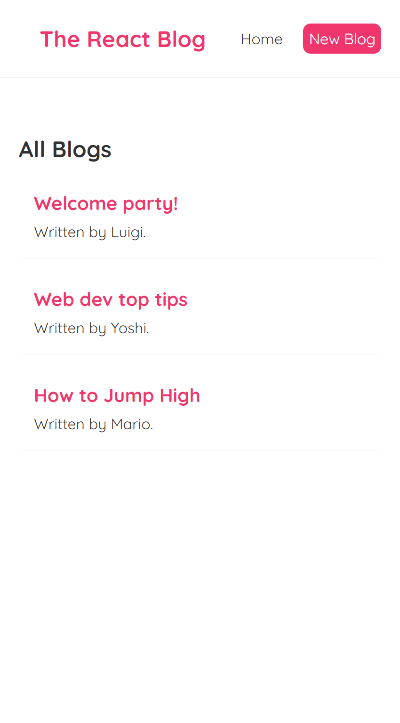
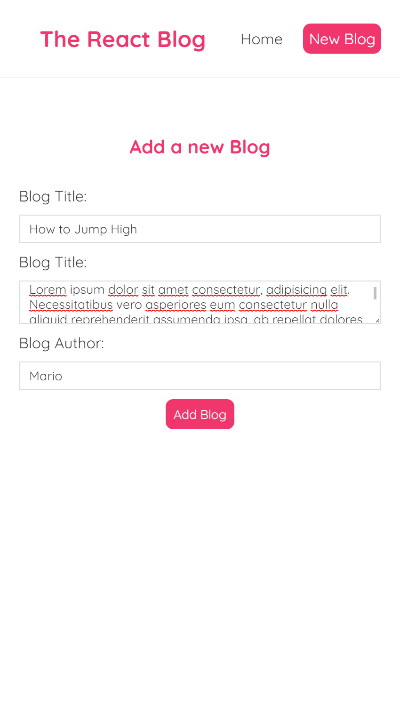
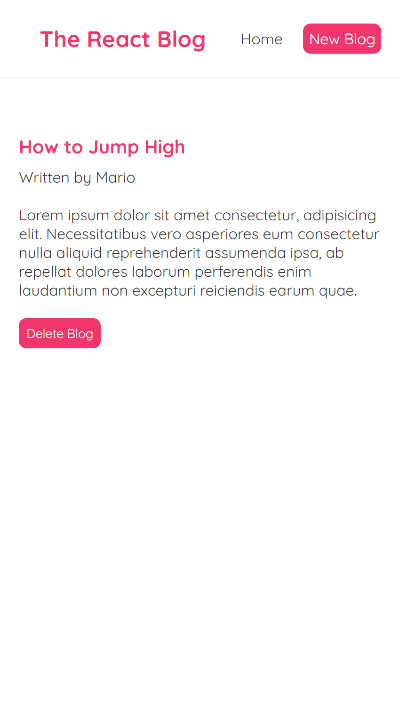

# React Blog

Projeto React Básico feito com o intuito de aprendizado, utilizando React 18 e JSON SERVER.

## Overview

Os usuários devem ser capazes de:

- Criar, editar e remover blogs

### Screenshots

 - Tela Principal

 - Tela de Cadastro

 - Tela Detalhes

## Tecnologias

### Feito com

- React 18
- JSON-SERVER

## Autor

- GitHub - [Philipe Mello](https://github.com/Philipessj1)
